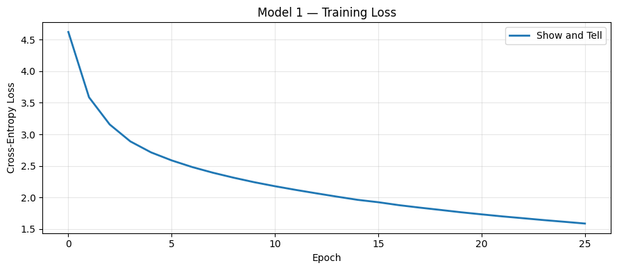
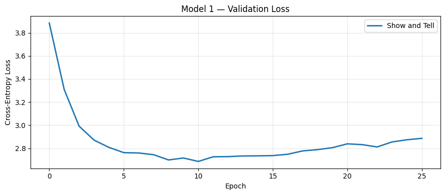
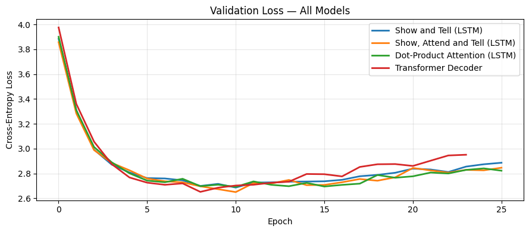
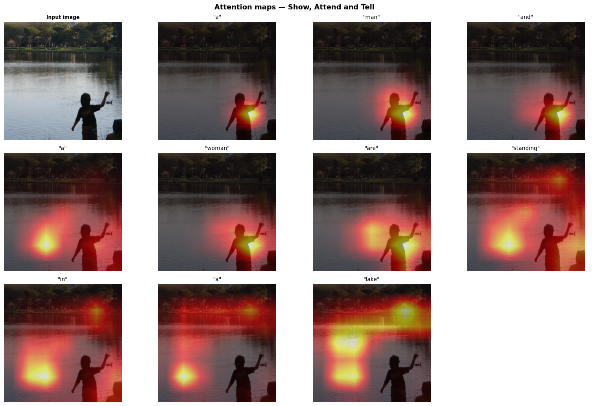

# Image Captioning on Flickr8k: A Comparative Study of Encoder-Decoder Architectures

**Piotr Salustowicz and Olgert Magilaj** - Team *Neural Narrators*
*MSE FTP - Deep Learning - Mandatory Practical Work 03*
*Both authors contributed equally to this work.*

## 1. Description of Approach

The objective of this project was to generate natural-language descriptions for unseen images. We implemented and compared two classic encoder-decoder architectures on the Flickr8k dataset: the "Show and Tell" baseline [1] and the attention-based "Show, Attend and Tell" model [2]. Both models utilize a shared, fine-tuned ResNet-18 encoder. To ensure a rigorous and fair comparison, all configurations were trained and evaluated under identical pipeline conditions, isolating the decoder design as the primary performance factor.

To prevent information leakage, the vocabulary was constructed exclusively from the training split by retaining words with a minimum frequency of 5, resulting in 2,649 unique tokens. Captions were padded to a maximum length of 40 tokens using standard structural tokens (`<pad>`, `<bos>`, `<eos>`, `<unk>`). Training utilized all 5 reference captions per image, yielding 32,365 pairs across 6,473 training images. For evaluation, metrics were calculated against all available references to ensure accuracy.

Images were converted to RGB, resized, and normalized using ImageNet channel statistics. To combat the risk of overfitting inherent to a small dataset like Flickr8k, strong data augmentation was applied during training, including random resized crops, horizontal flips, color jitter, and grayscale conversions. Evaluation utilized a deterministic resize to 256 followed by a center crop to 224 pixels.

## 2. Architectural and Implementation Choices

A fine-tuned ResNet-18 backbone serves as the feature extractor for all implementations. For the baseline model, features were extracted from the final adaptive average pooling layer and projected via a linear layer with batch normalization to produce a static 512-dimensional context vector. For the attention models, the network was truncated before the pooling layer to preserve a $512 \times 7 \times 7$ spatial feature map, providing 49 distinct regions for localized decoding.

The decoders were constructed around an `LSTMCell`. The baseline initializes the hidden and cell states directly with the global image vector, processing 256-dimensional word embeddings sequentially. The attention decoder incorporates Bahdanau additive attention over the 49 spatial regions to compute a dynamic context vector at each time step. A custom tokenizer and dedicated execution blocks handle teacher-forcing during training and autoregressive generation during inference. 

**Table 1: Training and Model Hyperparameters**

| Hyperparameter | Baseline Configuration | Attention Configuration |
|---|---|---|
| Dimensions (Encoder / Embedding / Hidden) | 512 / 256 / 512 | 512 / 256 / 512 |
| Attention Dimensionality | None | 256 |
| Dropout Probability | 0.2 | 0.2 |
| Learning Rate (Decoder / Encoder) | 5e-4 / 1e-5 | 5e-4 / 1e-5 |
| Weight Decay ($L_2$ Regularization) | 1e-3 | 1e-3 |
| Batch Size / Max Caption Length | 64 / 40 | 64 / 40 |
| Schedule (Warmup / Max Epochs / Patience) | 3 / 100 / 15 | 3 / 100 / 15 |

Beyond the core architectures, we extended our evaluation to include scaled dot-product attention, a Transformer decoder (utilizing multi-head cross-attention and learnable positional embeddings), beam-search decoding, and pretrained GloVe word embeddings.

## 3. Experimental Setup

Models were optimized using the Adam optimizer with a linear warmup and cosine decay learning rate schedule. Regularization techniques included a dropout rate of 0.2, weight decay of 1e-3, and early stopping with a patience of 15 epochs based on validation performance. 

The objective function was a masked cross-entropy loss that excluded padding tokens from gradient calculations. Training was executed using automatic mixed precision (AMP) on an NVIDIA H200 GPU, completing in approximately 15 to 20 minutes per run. The best-performing checkpoint was systematically reloaded for final test evaluation, and metrics were tracked continuously via Weights & Biases. Performance was quantified using validation perplexity and corpus BLEU (1 to 4) through the NLTK library.

## 4. Quantitative Results

Evaluation on the test set using greedy decoding revealed highly competitive results across the recurrent baselines, with the Transformer architecture demonstrating the highest absolute performance.

**Table 2: Test Set Evaluation Metrics (Greedy Decoding)**

| Model Architecture | Best Epoch | Perplexity | BLEU-1 | BLEU-2 | BLEU-3 | BLEU-4 |
|---|---|---|---|---|---|---|
| Show and Tell (Baseline) | 11 | 14.61 | 0.5871 | 0.4068 | 0.2708 | 0.1782 |
| Show, Attend and Tell (Bahdanau) | 11 | 14.68 | 0.5883 | 0.4096 | 0.2774 | 0.1862 |
| Dot-Product Attention LSTM | 11 | 14.27 | 0.5915 | 0.4148 | 0.2796 | 0.1866 |
| Transformer Decoder | 9 | 14.21 | 0.6151 | 0.4340 | 0.2983 | 0.2047 |

While training loss decreased consistently across all epochs, validation loss reached its optimum early (between epochs 9 and 12) before showing signs of divergence. This divergence indicates distinct overfitting driven by the constrained sample size of the dataset. 

*Figure 1: Training loss (top) and validation loss (bottom) curves for the baseline architecture. The validation curve demonstrates a clear performance inflection point around epoch 11.*

*Figure 2: Validation loss profiles across all evaluated decoder architectures. The Transformer decoder demonstrates the most rapid convergence and lowest overall validation minimum.*

Beam search with a beam width of $k = 5$ was evaluated on a 500-image test subset. This approach consistently out-performed greedy decoding across all metrics, with a notable improvement in higher-order BLEU scores, validating the benefits of a broader search space during generation.

**Table 3: Inference Strategy Comparison (Show, Attend and Tell, 500-Image Subset)**

| Strategy | BLEU-1 | BLEU-2 | BLEU-3 | BLEU-4 |
|---|---|---|---|---|
| Greedy Decoding | 0.6005 | 0.4233 | 0.2874 | 0.1912 |
| Beam Search ($k = 5$) | 0.6081 | 0.4387 | 0.3113 | 0.2172 |

Integrating pretrained GloVe embeddings yielded no significant advantage. Because our training corpus covered 99.5% of the vocabulary, the model was capable of learning effective semantic representations for this specific domain directly from the reference captions.

## 5. Qualitative Analysis

Qualitative review indicates that while all configurations succeed in identifying primary subjects (e.g., common animals, distinct landscape features), they exhibit a drop-off in higher-order sentence structure and detail coordination. This matches the steep numerical decline observed between BLEU-1 and BLEU-4.

*Figure 3: Generated caption examples from the Show, Attend and Tell model. Successful instances display accurate object localization, while typical errors involve descriptive omission or grammatical repetition.*

To evaluate the internal mechanics of the attention-based LSTM, spatial weights were extracted and visualized during inference.

*Figure 4: Sequential attention maps overlaid on a sample image. The network correctly focuses on distinct objects corresponding to concrete nouns, though the attention distribution tends to diffuse when generating structural or filler tokens.*

## 6. Discussion and Future Work

The experiments emphasize that dataset scale, rather than architectural capability, represents the primary bottleneck for this task. All evaluated models overfitted early, typically within 12 epochs, despite the implementation of aggressive data augmentations, dropout, and weight decay. 

Consequently, spatial attention mechanisms yielded only a marginal performance increase over the global baseline. The Transformer decoder offered the most significant structural advantage due to its efficient token-mixing properties. For generation refinement, beam search remains the most accessible method to improve caption fluency and structure. Future work should investigate larger pre-training corpora, alternative alignment metrics such as CIDEr or METEOR, and scheduled sampling to mitigate exposure bias.

## References
* [1] O. Vinyals, A. Toshev, S. Bengio, D. Erhan. *Show and Tell: A Neural Image Caption Generator.* 2015. arXiv:1411.4555.
* [2] K. Xu et al. *Show, Attend and Tell: Neural Image Caption Generation with Visual Attention.* ICML, 2015. arXiv:1502.03044.
* [3] D. Bahdanau, K. Cho, Y. Bengio. *Neural Machine Translation by Jointly Learning to Align and Translate.* ICLR, 2015. arXiv:1409.0473.
* [4] A. Vaswani et al. *Attention Is All You Need.* NeurIPS, 2017. arXiv:1706.03762.
* [5] J. Pennington, R. Socher, C. Manning. *GloVe: Global Vectors for Word Representation.* EMNLP, 2014.
* [6] K. He, X. Zhang, S. Ren, J. Sun. *Deep Residual Learning for Image Recognition.* CVPR, 2016. arXiv:1512.03385.